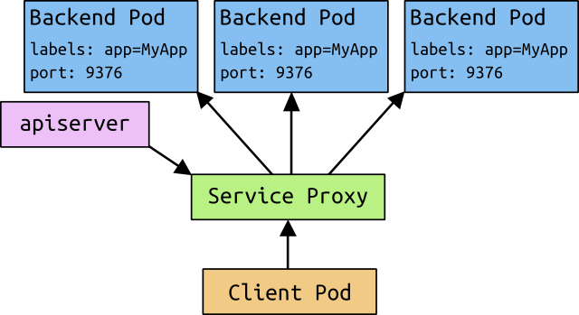
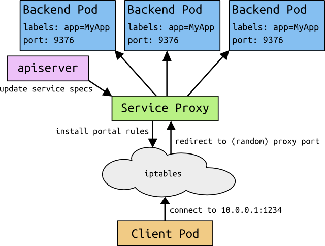

# Services in Kubernetes

## Overview

Kubernetes [`Pods`](pods.md) are ephemeral.  They can come and go over time, especially when
driven by things like [ReplicationControllers](replication-controller.md).
While each `pod` gets its own IP address, those IP addresses can not be relied
upon to be stable over time.  This leads to a problem: if some set of `pods`
(let's call them backends) provides functionality to other `pods` (let's call
them frontends) inside the Kubernetes cluster, how do those frontends find the
backends?

Enter `services`.

A Kubernetes `service` is an abstraction which defines a logical set of `pods` and
a policy by which to access them - sometimes called a micro-service.  The goal
of `services` is to provide a bridge for non-Kubernetes-native applications to
access backends without the need to write code that is specific to Kubernetes.
A `service` offers clients an IP and port pair which, when accessed, redirects
to the appropriate backends.  The set of `pods` targetted is determined by a label
selector.

As an example, consider an image-process backend which is running with 3 live
replicas.  Those replicas are fungible - frontends do not care which backend
they use.  While the actual `pods` that comprise the set may change, the
frontend client(s) do not need to know that.  The `service` abstraction
enables this decoupling.

## Defining a service

A `service` in Kubernetes is a REST object, similar to a `pod`.  Like a `pod` a
`service` definitions can be POSTed to the apiserver to create a new instance.
For example, suppose you have a set of `pods` that each expose port 9376 and
carry a label "app=MyApp".

```json
{
  "id": "myapp",
  "selector": {
    "app": "MyApp"
  },
  "containerPort": 9376,
  "protocol": "TCP",
  "port": 8765
}
```

This specification will create a new `service` named "myapp" which resolves to
TCP port 9376 on any `pod` with the "app=MyApp" label.  To access this
`service`, a client can simply connect to $MYAPP_SERVICE_HOST on port
$MYAPP_SERVICE_PORT.

## How do they work?

Each node in a Kubernetes cluster runs a `service proxy`.  This application
watches the Kubernetes master for the addition and removal of `service`
objects and `endpoints` (pods that satisfy a service's label selector), and
maintains a mapping of `service` to list of `endpoints`.  It opens a port on the
local node for each `service` and forwards traffic to backends (ostensibly
according to a policy, but the only policy supported for now is round-robin).

When a `pod` is scheduled, the master adds a set of environment variables for
each active `service`.  We support both
[Docker-links-compatible](https://docs.docker.com/userguide/dockerlinks/)
variables and simpler {SVCNAME}_SERVICE_HOST and {SVCNAME}_SERVICE_PORT
variables.  This does imply an ordering requirement - any `service` that a `pod`
wants to access must be created before the `pod` itself, or else the environment
variables will not be populated.  This restriction will be removed once DNS for
`services` is supported.

A `service`, through its label selector, can resolve to 0 or more `endpoints`.
Over the life of a `services`, the set of `pods` which comprise that
`services` can
grow, shrink, or turn over completely.  Clients will only see issues if they are
actively using a backend when that backend is removed from the `services` (and even
then, open connections will persist for some protocols).



## The gory details

The previous information should be sufficient for many people who just want to
use `services`.  However, there is a lot going on behind the scenes that may be
worth understanding.

### Avoiding collisions

One of the primary philosophies of Kubernetes is that users should not be
exposed to situations that could cause their actions to fail through no fault
of their own.  In this situation, we are looking at network ports - users
should not have to choose a port number if that choice might collide with
another user.  That is an isolation failure.

In order to allow users to choose a port number for their `services`, we must
ensure that no two `services` can collide.  We do that by allocating each
`service` its own IP address.

### IPs and Portals

Unlike `pod` IP addresses, which actually route to a fixed destination,
`service` IPs are not actually answered by a single host.  Instead, we use
`iptables` (packet processing logic in Linux) to define "virtual" IP addresses
which are transparently redirected as needed.  We call the tuple of the
`service` IP and the `service` port the `portal`.  When clients connect to the
`portal`, their traffic is automatically transported to an appropriate
endpoint.  The environment variables for `services` are actually populated in
terms of the portal IP and port.  We will be adding DNS support for
`services`, too.

As an example, consider the image processing application described above.
when the backend `services` is created, the Kubernetes master assigns a portal
IP address, for example 10.0.0.1.  Assuming the `service` port is 1234, the
portal is 10.0.0.1:1234.  The master stores that information, which is then
observed by all of the `service proxy` instances in the cluster.  When a proxy
sees a new portal, it opens a new random port, establish an iptables redirect
from the portal to this new port, and starts accepting connections on it.

When a client connects to `MYAPP_SERVICE_HOST` on the portal port (whether
they know the port statically or look it up as MYAPP_SERVICE_PORT), the
iptables rule kicks in, and redirects the packets to the `service proxy`'s own
port.  The `service proxy` chooses a backend, and starts proxying traffic from
the client to the backend.

The net result is that users can choose any `service` port they want without
risk of collision.  Clients can simply connect to an IP and port, without
being aware of which `pods` they are accessing.



## Shortcomings

Part of the `service` specification is a `createExternalLoadBalancer` flag,
which tells the master to make an external load balancer that points to the
service.  In order to do this today, the service proxy must answer on a known
(i.e. not random) port.  In this case, the service port is promoted to the
proxy port.  This means that is is still possible for users to collide with
each others services or with other pods.  We expect most `services` will not
set this flag, mitigating the exposure.

We expect that using iptables for portals will work at small scale, but will
not scale to large clusters with thousands of services.  See [the original
design proposal for
portals](https://github.com/GoogleCloudPlatform/kubernetes/issues/1107) for
more details.

## Future work

In the future we envision that the proxy policy can become more nuanced than
simple round robin balancing, for example master elected or sharded.  We also
envision that some `services` will have "real" load balancers, in which case the
portal will simply transport the packets there.
